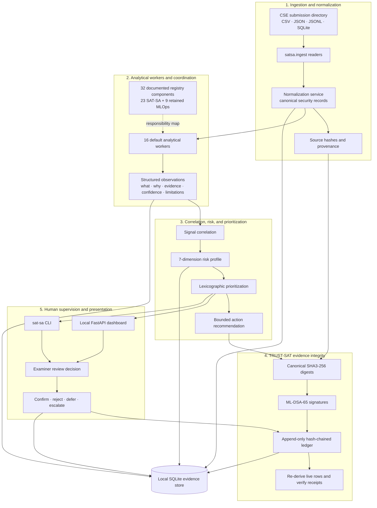

# SAT-SA system architecture

SAT-SA is an offline, periodic supervisory analytics tool for human examiners
assessing Constituent Security Entity (CSE) SOC operations. It is not a
real-time SIEM, IDS, autonomous decision maker, or continuous telemetry
collector.

## System flow

## Component responsibilities

| Layer | Primary implementation | Responsibility |
|---|---|---|
| Ingestion | `satsa/ingest/` | Reads supported submission formats, hashes sources, and normalizes six evidence categories: alerts, cases, investigation steps, escalations, dispositions, and assets. |
| Analytics | `satsa/analysis/workers/` | Runs the 16-worker default set for execution gaps, negative space, anomaly, peer, coverage, drift, cross-entity, similarity, evidence-completeness, workflow, and entity/asset checks. |
| Assessment | `satsa/analysis/` | Correlates related observations, computes a decomposable seven-dimension risk profile, ranks work, and supplies bounded action hints. |
| Trust | `satsa/analysis/trust.py`, `qsmlops/evidence/` | Produces canonical digests, ML-DSA-65 receipts, and an append-only evidence ledger; verification detects divergence from live database rows. |
| Human authority | `satsa/ui/`, `satsa/cli.py`, `satsa/analysis/review.py` | Presents evidence and records examiner decisions. Agents recommend; a human examiner retains terminal authority. |

## Input to decision lifecycle

1. A CSE submission is read, source-hashed, and normalized into canonical
   records.
2. The default worker set evaluates the records and emits explainable
   observations and findings.
3. SAT-SA correlates related evidence, calculates risk, and creates a
   prioritized review queue.
4. TRUST-SAT binds evidence to canonical SHA3-256 digests, ML-DSA-65 receipts,
   and the hash-chained ledger.
5. An examiner reviews the evidence and records a decision. The decision is
   appended to the ledger; it is never silently rewritten.

## Boundaries and limitations

- The application runs locally against SQLite and makes no network calls in
  its analytics pipeline. It does not itself provide database encryption at
  rest or HTTPS termination; production deployment must supply appropriate
  filesystem protection and reverse-proxy/TLS controls.
- ML-DSA-65 uses the repository's pure-Python provider. This is not a claim of
  a physical PQC HSM or side-channel-hardening.
- CIC-IDS2017 and Splunk BOTS support consists of schema-compatible adapters
  and controlled workflow scenarios, not a claim that their raw source
  datasets have been processed here.
- Default risk weights are initial, decomposable policy weights; calibration
  requires domain-expert evidence and labels.
