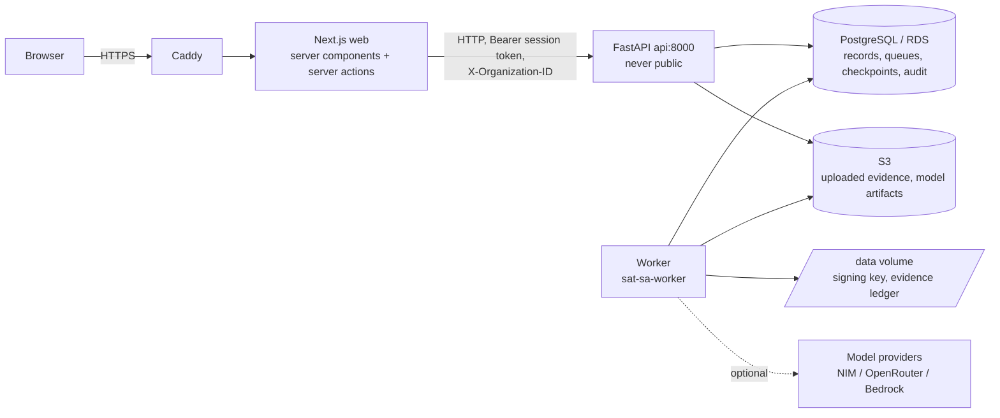
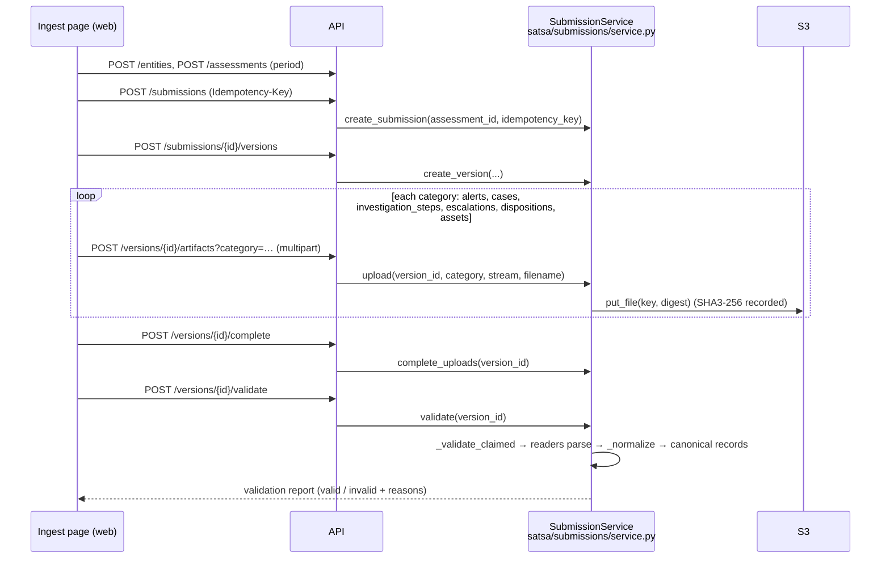
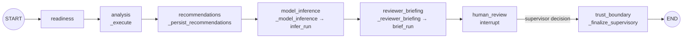

# System Flow

How data enters SAT-SA / TRUST-SAT, the order things run in, which
functions call which, and why each step exists. Function names are the real
ones in the repository; file paths are relative to the repo root.

## 1. Big picture



- The **browser** never talks to the API directly. Next.js server code calls
  the API (`web/src/lib/api/client.ts` `call()` / `raw()`), forwarding the
  session token from the HttpOnly cookie as a Bearer token, the selected
  organization as `X-Organization-ID`, and the client address as
  `X-Forwarded-For` (so rate limits apply per real client).
- The **API** validates, authorizes, writes records and enqueues work. It
  never runs analysis.
- The **worker** runs analysis and ML jobs and is the only process with
  model-provider keys and the signing key.
- Why this split: long analysis must not block HTTP; a crashed worker must
  not lose work (database leases); secrets stay in one process.

## 2. Request path (every API call)

```
FastAPI route (satsa/api/__init__.py, satsa/api/ml_routes.py)
 └─ Depends(tenant)  → TenantRepository                 (Tenant = Annotated[...])
     ├─ authenticate_token(app, token)                  satsa/api/security.py
     │    session digest lookup → user, identity, role
     ├─ organization from X-Organization-ID → active membership check
     ├─ rate limiter: login 5/min, mutations 30/min, reads 300/min per address
     └─ TenantRepository._require(permission)           role → permission set
 └─ service method (Submission/Execution/MLOps service)
 └─ audit_action(...) → audit_events (+ identity ledger)
 └─ JSON response (Pydantic schema in satsa/api/schemas.py)
```

Why: every data access is scoped to one organization at the repository
layer, so a route cannot forget tenant isolation; the server is the
authority for roles (the UI only hides controls).

## 3. Sign-in and session

```
POST /api/v1/session {credential}          satsa/api/__init__.py login()
 ├─ limiter.check("login:<address>", 5)
 ├─ Origin must be allowed (login CSRF)
 ├─ authenticate_token(app, credential)     credential = key_id.secret
 ├─ SessionRepository.create(user_id, ttl)  stores SHA3(token), never the token
 └─ Set-Cookie satsa_api_session (HttpOnly, path /api/v1) + csrf_token
DELETE /api/v1/session                      revokes the session (later use → 401)
```

The web tier keeps its own cookie with the session token and sends it as
Bearer. Verified on AWS: token works (200) → sign out (204) → same token 401.

## 4. Ingestion: how data enters



- Uploads are streamed to `/tmp`, size-limited, hashed (SHA3-256), stored
  under a content key, and recorded in `satsa_artifacts`.
- `validate()` parses each artifact (`satsa/submissions/readers.py`),
  normalizes rows into canonical source records (`satsa_source_records`,
  `satsa_version_records`) and stores a snapshot digest on the version.
- Why idempotency keys: a retried request (network, double click) returns
  the same object instead of creating duplicates.

## 5. Starting a run

```
POST /api/v1/runs {submission_version_id, execution_mode}   start()
 └─ AnalysisExecutionService.create_run(...)                satsa/analysis/execution.py
     ├─ _require(ANALYSIS_RUN)
     ├─ version must belong to the org and be status "valid"
     ├─ insert satsa_runs (queued) + satsa_execution_jobs row (the queue entry)
     ├─ _audit("analysis.run_queued")
 └─ run_view(row, svc)  → if graph run already running/awaiting: get_graph_progress()
```

`get_graph_progress` reads the latest LangGraph checkpoint and refuses (403)
when its scope (run, organization, version) does not match the run; a
checkpoint with no scope yet (the graph is just starting) reads as
`"starting"` (Phase 23 fix, see decisions.md D-020).

## 6. Worker: execution order

```
worker_main()                                   satsa/analysis/execution.py
 loop:
   AnalysisExecutionWorker.run_once()           analysis queue
   MLJobWorker.run_once()                       satsa/mlops/jobs.py (dataset validation, training, drift)
```
Both queues get a turn every loop so one cannot starve the other.

### 6.1 `AnalysisExecutionWorker.run_once()`

```
run_once()
 ├─ ExecutionQueue.claim(worker_id)        lease row; expired leases are reclaimable
 ├─ _resolve_context(lease)               run, version, entity, assessment, flags
 ├─ graph run? ── yes ──► AnalysisGraphRuntime(worker, lease, context, checkpointer).run()
 │                         (section 7) → returns "awaiting_review" or a final status
 └─ no (standard run):
     ├─ _execute(lease, context)          the analytical stages (6.2)
     ├─ if review_required:
     │    _persist_recommendations → _model_inference → _reviewer_briefing
     │    queue.pause_for_review → "awaiting_review"
     └─ else _finish(lease) → _finalize_supervisory / queue.complete / _attest_if_configured
 errors: RetryableAnalysisError → queue.fail(retryable) ; CancelAtBoundary → cancelled ;
         LeaseLost → stop without writing
```

### 6.2 `_execute(lease, context)`: analytics

```
_execute
 ├─ _load_dataset(context, org)            canonical records → CanonicalDataset
 ├─ workers = workers_factory()            default: _default_workers(DEFAULT_FAST_CLOSURE_POLICY)
 ├─ create satsa_jobs rows (one per analytical worker, skip finished ones on resume)
 ├─ Orchestrator().register(worker) …     satsa/contracts/orchestration.py
 ├─ orch.run(..., skip_workers=_completed_worker_names(run))
 │    for each stage:
 │      _assert_lease → _cancel_requested? → _step_start
 │      worker computes observations / findings
 │      _persist_stage(lease, context, job)   observations, findings, evidence refs
 │      (peer workers use _organization_peer_baseline)
 └─ _persist_risk(lease, context)          entity risk profile (7 dimensions)
```

Why per-stage persistence: a crash mid-run resumes at the first unfinished
stage instead of redoing finished work.

## 7. LangGraph run (graph mode, the default)



- Graph: `satsa/analysis/graph.py` `AnalysisGraphRuntime`; nodes call the
  worker methods above. Each node runs `_check(state)` (lease still held,
  not cancelled) first.
- Checkpoints: `durable_checkpointer(engine)` (PostgreSQL in production),
  thread id `satsa:<run_id>`. After every node the state is saved, so a
  restart resumes at the next node.
- `human_review` calls LangGraph `interrupt(...)`: the run is set to
  `awaiting_review` and the lease is released. Nothing else happens until a
  supervisor decides.

### 7.1 Supervisor decision and resume

```
POST /api/v1/runs/{id}/decision {action: confirm|dismiss|escalate, reason}
 └─ AnalysisExecutionService.decide(run_id, action, reason)
     ├─ run must be awaiting_review; one decision per run (409 otherwise)
     ├─ insert satsa_run_review_decisions (user, identity, reason)
     └─ requeue the run (status → queued)
worker claims it again → AnalysisGraphRuntime.run() resumes with Command(resume=decision_id)
 └─ trust_boundary → _finalize_supervisory(lease)
      └─ TrustService(db, key_dir, organization_id).finalize(run_id, audit, boundary=...)
           ├─ canonical supervisory document: run, findings, risk, recommendations,
           │  model inference record, reviewer briefing record, decision
           ├─ digest → ML-DSA-65 signature → satsa_trust_receipts / satsa_trust_finalizations
           └─ evidence ledger append (/data/satsa/evidence-ledger.jsonl) + audit events
     queue.complete(lease, "completed")
```

Why the decision comes before signing: the signed record states what the
human decided; the model and briefing are bound in as context, never as the
decision.

### 7.2 Verification

```
POST /api/v1/runs/{id}/verify → svc.verify_trust(run_id)
 └─ TrustService.verify_subject / finalization lookup:
    re-derive the canonical digest from live rows, check the signature
 → verified | not_finalized | inconsistent | unavailable   (+ audit event)
```

## 8. Model advisory and reviewer briefing (inside the run)

```
_model_inference(lease) → satsa/mlops/inference.py infer_run(db, storage, org, run_id)
 ├─ active_deployment(org)? no → record abstention "no_deployed_model"
 ├─ features for the run (features.py, review-outcome-features/1)
 ├─ _cached_model → verify artifact digest from S3
 ├─ out-of-distribution / low-confidence → abstain with reason
 └─ satsa_ml_inferences row (score or abstention, model id, digest)
_reviewer_briefing(lease) → satsa/llm/briefing.py brief_run(db, org, run_id)
 ├─ facts_for_run(...)         deterministic facts from stored records
 ├─ run_chain(...)             satsa/llm/chain.py: providers from SATSA_LLM_CHAIN,
 │                             bounded retries, deadline, output validate()
 ├─ fallback: deterministic(facts) ; last resort: abstain
 └─ satsa_llm_outputs row (status, provider, attempts, digest)
```

Neither step can change findings or decisions; failures here are logged and
the run continues (briefing failure is caught in `_reviewer_briefing`).
Production has no provider secret, so briefings are `deterministic`.

## 9. MLOps lifecycle

```
POST /ml/datasets          → MLOpsService.create_dataset → datasets.create_dataset
                              build_snapshot (decided runs → features + labels)
                              → register_snapshot (content-addressed, SHA3, S3)
POST /ml/datasets/{id}/validate → ML job "validate_dataset"   (MLJobWorker)
POST /ml/training-runs     → ML job "train" → training.train → evaluate → verification
                              → registry.register (passport, artifact to S3,
                                state verified | quarantined)
POST /ml/models/{id}/approve  → registry.approve   (trainer cannot approve own model)
POST /ml/models/{id}/deploy   → registry.deploy    (approved only; one active per org)
POST /ml/rollback             → registry.rollback  (to a previously approved model)
POST /ml/drift-checks         → ML job "drift" → monitoring (PSI, ≥30 samples else insufficient_data)
POST /ml/retraining-requests  → open request; accept → new training job
```

Labels come only from recorded supervisory decisions (1 = confirm or
escalate, 0 = dismiss). Policy thresholds: `satsa/mlops/policy.py`.

## 10. Web tier

```
page (server component, web/src/app/(app)/workbench/...)
 └─ requireContext()            session + organization (redirects to /login or /organization)
 └─ api.*() in lib/api/client.ts → call() → raw() → fetch(API)
 └─ <AutoRefresh> while work is in progress (router.refresh every 10 s)
user action → client component (components/domain/*-controls.tsx)
 └─ server action (lib/workbench/actions.ts, "use server") → API mutation
 └─ router.refresh() to re-read persisted state
```

Why server actions: credentials and session tokens never reach browser
JavaScript; the browser only holds an HttpOnly cookie.

## 11. Deployment and operations

```
local: bash deploy/aws/publish.sh --stack satsa-prod
 ├─ git archive <commit> → docker build (SATSA_RELEASE=<commit>) → ECR :<12-char tag>
 ├─ release bundle → s3://…/releases/<commit>/deploy.tgz (+ sha256)
 └─ SSM send-command → /opt/satsa/releases/<commit>/deploy/aws/deploy.sh deploy <commit>
on EC2: deploy.sh deploy
 ├─ prepare_data (/data mounted, owner 10001) ; verify bundle checksum
 ├─ site address from SSM /satsa/prod/site-address (+ sslip alias)
 ├─ render_env (RDS secret → production.env) ; render_llm_env (worker-only llm.env)
 ├─ refuse if an initialized /data lost its signing key
 ├─ compose run migrate ; compose run key-init ; compose up api worker web caddy
 ├─ wait_healthy (container health + https://<site>/login)
 └─ write /etc/satsa/deployed.json
other: deploy.sh status | logs | restart | snapshot | public-e2e | demo | bootstrap-admin
```

Administrator credential rotation (manual, through SSM; runbook "Rotating secrets"):

```
old admin credential (Secrets Manager satsa/prod/admin-credential)
 ├─ DELETE /api/v1/members/{id} per demo member     exposed demo credentials stop working
 ├─ POST /api/v1/members role satsa_admin            new identity, credential shown once
 ├─ secretsmanager put-secret-value (from response)  never printed; read back and compared
 ├─ DELETE /api/v1/session, Bearer = raw old cred    revokes the credential and its sessions
 │    └─ identities.revoke_credential()               satsa/api/__init__.py logout()
 ├─ new: DELETE /api/v1/members/{old user}            removes the old membership as well
 ├─ checks: old → 401 (session, login, tenant), new → 200
 ├─ /root/satsa-e2e/credentials.json admin replaced
 └─ deploy.sh demo                                   fresh demo org under the new admin
```

Why the credential revoke: a membership revoke is per organization, while a
credential authenticates in every organization the identity belongs to.

## 12. Changes in this session (Phase 23)

What changed in the flow above, and where:

| Area | Change | Commit |
|---|---|---|
| Release identity | `SATSA_RELEASE` baked into images; `/health/live` `release`; System page; `deploy.sh status` | `a626a9b`, `d7df0da` |
| Operations | `deploy.sh` `logs`, `restart`, `demo`; runbook sections | `a626a9b` |
| Demo | `scripts/demo_environment.py`; unique demo identities | `a626a9b`, `d7df0da`, `f0aeac8` |
| MLOps demo | `scripts/demo_mlops.py` (≥5-signal rule, resumable), 429 retry in `seed_demo_via_api.py` | `21fa972`, `cc8f0e6`, `b60a051` |
| Web polling | `AutoRefresh` 3 s → 10 s (section 10) | `5ba4bfe` |
| Database | migration 19: audit organization expression index, ML list indexes | `1d89bc8` |
| Domain | site address via SSM; Caddy aliases (section 11) | `758af7e` |
| Graph | early-checkpoint scope fix in `get_graph_progress` (section 5) | `cc8f0e6` |
| Brand | TRUST-SAT icon, favicon, brand mark, nav/hero/titles | `a41e4f8`, `83bb687` |
| UI text | abstention counts `"40 × no deployed model"` | `b60a051` |
| Tests | `test_phase23_release.py`, `test_phase23_indexes.py`, two graph tests; E2E resilience and organization picker | several |
| Docs | AWS runbook, deployment status, restore drill record, discovery doc marked historical | `f19ea36`, `ecf8d30` |

Rationale for each change is in `decisions.md` (D-013 to D-022).

## 13. Changes in this session (Phase 23 operations: credential rotation)

| Area | Change | Files | Commit | Decision |
|---|---|---|---|---|
| Operations | Rotated the exposed production administrator credential and revoked the old credential, its sessions and its membership | none (live system) | none | D-023 |
| Demo | Revoked the exposed demo members and created a fresh demo organization with `deploy.sh demo` | none (live system) | none | D-023 |
| Docs | Runbook rotation steps now revoke the credential itself and update the E2E credentials file | `deploy/aws/README.md` | `04fc7e7` | D-023 |
